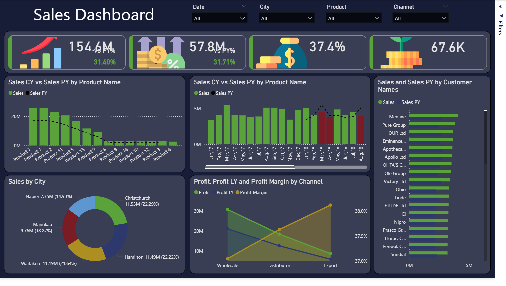

# 📊 Sales Performance Dashboard

A complete end‑to‑end Sales Analytics project featuring data cleaning, EDA, dimensional modeling, DAX measures, and an executive‑level Power BI dashboard.

---

## 🚀 Features

- Cleaned and validated sales dataset  
- Full Exploratory Data Analysis (EDA)  
- Star schema data model  
- Power BI dashboard with KPIs, trends, and insights  
- Professional GitHub project structure  

---

## 📁 Repository Structure

```
sales-performance-dashboard/
│
├── data/
│   ├── raw/
│   └── processed/
│
├── pbix/
│   └── Sales_Dashboard.pbix
│
├── eda/
│   ├── eda_report.ipynb
│   └── eda_visuals/
│
├── images/
│   ├── dashboard_preview.png
│   └── key_insights.png
│
├── docs/
│   ├── project_overview.md
│   ├── data_dictionary.md
│   └── methodology.md
│
├── scripts/
│   ├── data_cleaning.py
│   ├── eda_analysis.py
│   └── utils.py
│
├── README.md
└── LICENSE
```

---

## 📘 Documentation

- **Project Overview:** `docs/project_overview.md`  
- **Data Dictionary:** `docs/data_dictionary.md`  
- **Methodology:** `docs/methodology.md`  
- **EDA Notebook:** `eda/eda_report.ipynb`  

---

## 🛠 Tools Used

- Python (Pandas, Seaborn, Matplotlib)  
- Power BI Desktop  
- Jupyter Notebook  
- GitHub  

---

## 📈 Dashboard Preview




---

# 📐 Star Schema Diagram

```mermaid
erDiagram
    SALES {
        int order_number
        date order_date
        int customer_name_index
        int product_description_index
        int delivery_region_index
        int order_quantity
        float unit_selling_price
        float unit_cost
        float sales
        float total_cost
        float profit
    }

    PRODUCTS {
        int index
        string product_name
    }

    CUSTOMERS {
        int customer_index
        string customer_names
    }

    REGIONS {
        int index
        string suburb
        string city
        int postcode
        float longitude
        float latitude
    }

    DATES {
        date date
        int year
        string quarter
        int month_no
        string month_name
    }

    SALES ||--|{ PRODUCTS : "product_description_index = index"
    SALES ||--|{ CUSTOMERS : "customer_name_index = customer_index"
    SALES ||--|{ REGIONS : "delivery_region_index = index"
    SALES ||--|{ DATES : "order_date = date"


---

# ✅ **4. DAX Documentation File (docs/dax_measures.md)**

```markdown
# 📘 DAX Measures Documentation

This document lists all DAX measures used in the Sales Performance Dashboard.

---

## 🧮 Sales Measures

### **Total Sales**
```DAX
Total Sales = SUM(Sales_Data[Sales])

Sales CY

Sales CY =
CALCULATE(
    [Total Sales],
    YEAR(DateTable[Date]) = YEAR(TODAY())
)

Sales PY

Sales PY =
CALCULATE(
    [Total Sales],
    SAMEPERIODLASTYEAR(DateTable[Date])
)

Sales Growth %

Sales Growth % =
DIVIDE([Sales CY] - [Sales PY], [Sales PY])

💰 Profit Measures

Total Profit = SUM(Sales_Data[Profit])

Profit Margin

Profit Margin =
DIVIDE([Total Profit], [Total Sales])

Profit CY

Profit CY =
CALCULATE(
    [Total Profit],
    YEAR(DateTable[Date]) = YEAR(TODAY())
)

Profit PY

Profit PY =
CALCULATE(
    [Total Profit],
    SAMEPERIODLASTYEAR(DateTable[Date])
)

Profit Growth %

Profit Growth % =
DIVIDE([Profit CY] - [Profit PY], [Profit PY])


📦 Units Sold

Units Sold = SUM(Sales_Data[Order Quantity])

---

## 🧠 Key Insights

- Product 7 is the top revenue generator  
- Sales show strong YoY growth  
- Profit margin remains stable across channels  
- Napier and Manukau lead in city‑level sales  
- Customer distribution shows clear high‑value segments  

---

## 📦 How to Use

1. Open `data/processed/sales_cleaned.csv`  
2. Load into Power BI  
3. Connect dimension tables  
4. Apply DAX measures  
5. Explore the dashboard  

---

## 👤 Author

**Girish Kumar**  
Data Analyst & BI Developer  

---

This repository demonstrates strong BI engineering, analytical thinking, and dashboard design skills.
